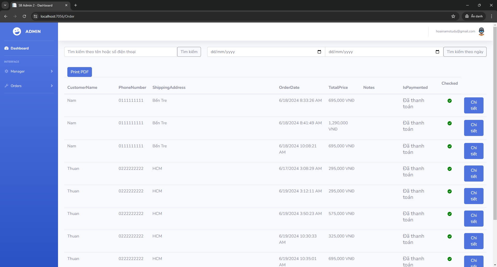

# MEN FASHION

MEN FASHION là nền tảng website trực tuyến cung cấp các sản phẩm thời trang nam đa dạng về kiểu dáng, màu sắc và mẫu mã.

## Các chức năng cơ bản

### 1. Người dùng
- Giao diện người dùng thân thiện, dễ sử dụng
  
- Giao diện shop hiển thị các sản phẩm thời trang
  
- Chức năng đăng nhập, đăng ký
  
  
- Xác thực email sau khi đăng ký
  
  
  
- Đăng nhập và đăng ký bằng Facebook, Google
  
- Hiển thị tên người dùng và cập nhật số điện thoại
  
- Quên mật khẩu và chức năng đổi mật khẩu
  
  
  
  
  
- Lọc sản phẩm theo loại
  
- Sắp xếp sản phẩm theo giá
  
- Tìm kiếm sản phẩm theo tên
  
- Thêm sản phẩm vào giỏ hàng và thanh toán
  
  
  
  
- Hỗ trợ thanh toán qua VNPay và PayPal
  
  
  
  
- Hiển thị lịch sử đơn hàng của người dùng
  
- Đánh giá và review sản phẩm
  
- Hiển thị các review từ người dùng khác
  
- Tương tác với shop qua email
  
- Áp dụng mã giảm giá khi thanh toán
  

### 2. Admin
- Giao diện quản trị viên để quản lý shop
  
- Thêm, xóa, sửa và xem chi tiết sản phẩm
  
- Quản lý loại sản phẩm
  
- Quản lý người dùng
  
- Hiển thị và lọc danh sách đơn hàng
  
  
- Xác nhận đơn hàng từ shop
  
- Giao diện quản lý đơn hàng mới
  
- Quản lý mã giảm giá (coupon)
  
- Xuất file hiển thị tổng quan doanh thu
  
- Xuất file hóa đơn cho khách hàng
  
- Tùy chỉnh mô tả sản phẩm chi tiết
  

## Thành viên
- [Trần Hoài Nam](#https://github.com/hoainam1308) - Team Leader/Fullstack
- [Hoàng Châu Phúc Thuận](#https://github.com/AlivRick) - Fullstack
